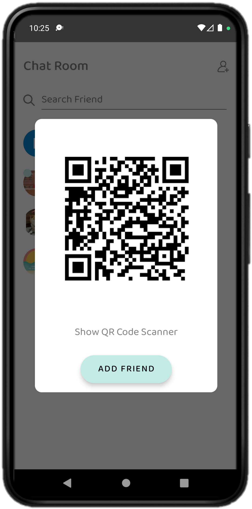

# Min Map - Meet up with friends
  

Min Map is an app that helps everyone meet up with friends easier. Mainly use the map to select the meeting point, send invitations, and combine with route planning and navigation, track participants’ location and chat room.

 

Welcome to download. Can't wait to meet you here!

## Features
### Login
- Supported Google Login.

### Map
- There's two way to start a new activity:
  * Click the button above
  * Select any place on the map
- After selecting meeting point, click "Send Invitation" button to invite friends.
- The customized route according to the user's location to the destination will be displayed on the screen.
- Click "Start Navigation" button to start text and voice navigation.
- You can check the meeting point and participants' location through clicking bottom right mark button and upper right participants' picture any time during navigation.

   

### Chat Room / Message
- Click bottom right message button to enter chat room.
- Click upper right button to add friend by scanning QR code.
- If there's an activity in the chat room, the reminder dot will be shown in the upper left corner of the chat room picture.
- One single click of bottom left button to find mid-point of all participants' location and send invitation.
- Supported simple chips to send message more efficiently.

  

## Technical Highlights
- Architected the **`MVVM with repository pattern`** to create a scalable and maintainable project
- Applied **`View Binding`** within whole project to decouple the logic from the view
- Customize map interactive components with **`Google Map SDK`** to create a user-friendly UI
- Implemented **`Google Map Directions API`** to calculate and present the customize route planning with **`PolyOptions`** to improve the fluency
- Operated **`Google Map Places API`** to provide better searching location solution
- Connected RESTful APIs with **`Retrofit`** by parsing JSON with **`Moshi`**
- Implemented **`Firebase Cloud Messaging`** (deploy script to server) to accomplish cloud push notification to enhance function completion
- Supported **`Android TTS (Text-To-Speech)`** and navigation instruction with Foreground Service and notification to optimize user experience
- Managed user login flow with **`Google Sign-In SDK`** and **`Firebase Authentication`**
- Organized data management with **`Firebase Firestore`**
- Achieved real-time chat room by using **`Firestore SnapshotListener`**
- Designed finding mid-point and shortest path of all participants' location with computing geometric center of a polygon
- Implemented **`Adaptive icons`** supporting Material You design

## Release Note
| Version | Description |
| ------- | ----------- |
| **1.0.7** | Fix group chat room bug and optimize voice navigation |
| **1.0.6** | Official Release on Google Play Store |
| **1.0.5** | Pre-market development and internal testing |

## Libraries
- [Moshi](https://github.com/square/moshi)
- [Glide](https://github.com/bumptech/glide)
- [Lottie](https://github.com/airbnb/lottie-android)
- [ZXing Android Embedded](https://github.com/journeyapps/zxing-android-embedded)

## Requirement
SDK version 26+
Gradle version 7.3.3
Android Studio version Chipmunk | 2021.2.1 Patch 2

## Contact
Mindy Hsu
mindy840204@gmail.com
